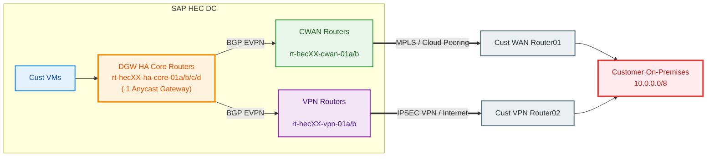
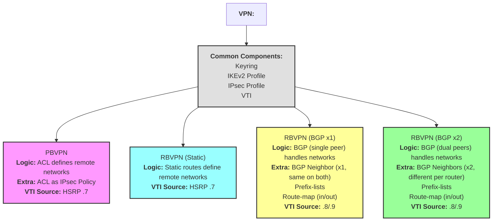
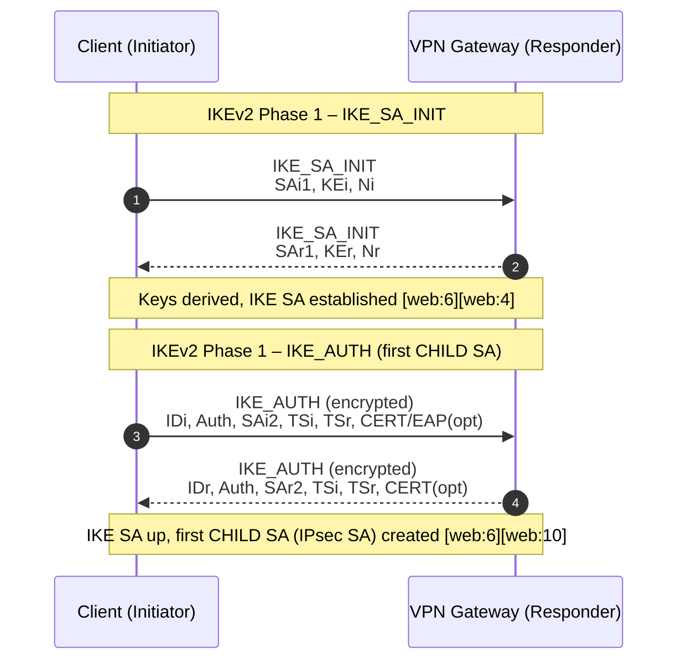
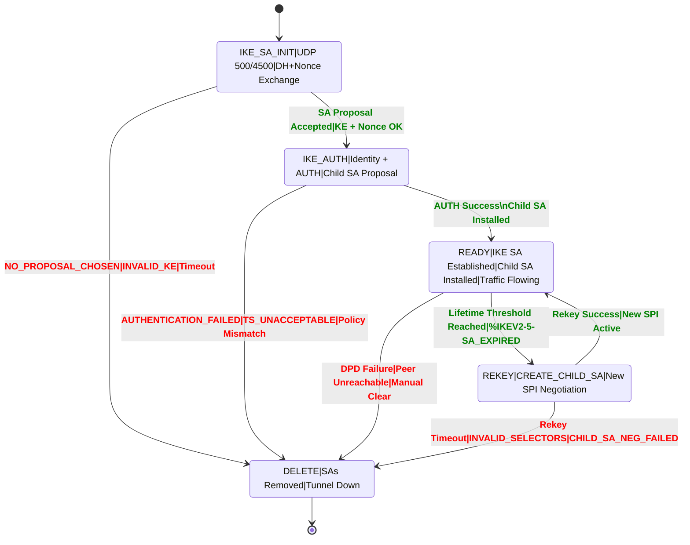

# VRF-Aware IPsec VPN with EVPN Stitching 
## Design, Configuration Breakdown & Verification (Cisco IOS XE)

## 1. Purpose of This Design

This design enables:

- Secure **policy & route-based IPsec VPN** termination
- **Per-customer routing isolation** using VRFs
- **EVPN L3 (Type-5) integration** with Arista HA core
- **Deterministic PE preference** using AS-path prepending
- **Hot-standby paths** across multiple PEs without HA-core changes

<br>

**Order of Preference for HA-Core:**

| Priority |  Device  |    Role   |
| :------: | :------: | :-------: |
|     1    | cwan-01a |  Primary  |
|     2    | cwan-01b | Secondary |
|     3    |  vpn-01a |  Third    |
|     4    |  vpn-01b |   Fourth  |

<br>

**Typical Customer On-premises Connectivity**



Changing customer preference is done by **moving the RT between PRIO lists**, not by modifying HA-core config.

---

## 2. VRF Definition – Customer Routing Isolation

### Configuration
```java
vrf definition CUSTOMER_0120
 description HEC17-CUSTOMER_0120-XIP
 rd 17:3120
 address-family ipv4
  route-target export 17:3120 stitching
  route-target import 17:2120 stitching
```

Why this is required:
- Creates a dedicated routing table per customer
- Allows overlapping IP space
- Enables EVPN stitching into the HA core

What breaks if missing
- Customer routes never reach EVPN
- Traffic is confined to a single PE

### Verification
```java
show vrf detail CUSTOMER_0120
show running-config vrf CUSTOMER_0120
show bgp l2vpn evpn route-target 17:3120
```

## 3. Bridge-Domain, BDI & L3 VNI (EVPN ↔ VRF Glue)

### BDI – L3 Gateway for EVPN
```java
interface BDI3120
 vrf forwarding CUSTOMER_0120
 ip address 198.19.248.254 255.255.255.254
```

### Bridge-Domain & VNI
```java
bridge-domain 3120
 member vni 3171200
!
interface nve1
 member vni 3171200 vrf CUSTOMER_0120
```

Why this is required
- BDI is the **L3 termination point** for EVPN routes
- Bridge-domain maps **EVPN VNI ↔ VRF**
- Enables **EVPN Type-5 route exchange**

What breaks if missing
- EVPN routes appear in control plane but **NOT** in routing table
- No forwarding between EVPN fabric and VPN

### Verification
```java
show interface BDI3120
show bridge-domain 3120
show nve vni
show ip route vrf CUSTOMER_0120
```

## 4. EVPN Priority Classification (HA Preference Control)

### Primary VPN Router (vpn-01a)
```java
ip extcommunity-list standard CL-EVPN-PRIO3
 permit rt 17:3120
```

### Secondary VPN Router (vpn-01b)
```java
ip extcommunity-list standard CL-EVPN-PRIO4
 permit rt 17:3120
```

Why this is required
- Groups customer EVPN routes into **priority tiers**
- Each tier applies a **different AS-path prepend**
- HA core always selects the **shortest AS-path**

What breaks if missing
- Wrong PE becomes active
- Traffic flows via unexpected path

### Verification
```java
show running-config | section extcommunity-list
show bgp l2vpn evpn route-target 17:3120 detail
show bgp l2vpn evpn neighbors <ha-core-peer> advertised-routes
```

## 5. VPN Configuration

### Crypto Keyring
```
crypto ikev2 keyring KR_GTY
   peer 196.41.253.229
      address 196.41.253.229
      pre-shared-key local cBqEfYyzdZNEDfytTA6u8g3vnDQvfb
      pre-shared-key remote cBqEfYyzdZNEDfytTA6u8g3vnDQvfb
!
```

Why this is required
- Defines the **pre-shared-key** which should be **identical** on both customer and SAP side.

What breaks if missing
- Phase1 status remains in ```MM_NO_STATE```

### Verification
```java
show running-config | section extcommunity-list
show bgp l2vpn evpn route-target 17:3120 detail
show bgp l2vpn evpn neighbors <ha-core-peer> advertised-routes
```

## 6. Customer-Specific VPN Components

### Crypto Keyring

```java
crypto ikev2 keyring KR_TST
 peer P_203.13.156.7
   address 203.13.156.7
   pre-shared-key local find-me-if-you-can
   pre-shared-key remote find-me-if-you-can
 !
```

#### Why this is required

- Defines the remote peer and pre-shared keys for IKEv2 authentication.
- Ensures both ends of the VPN tunnel use the same credentials for secure establishment.

#### What breaks if missing

- IKEv2 negotiation will fail; tunnel cannot be established.
- Authentication errors will prevent Phase 1 from completing.
- IKE state: `MM_NO_STATE` or `NO_PROPOSAL_CHOSEN`.

---

### IKEv2 Profile

```java
crypto ikev2 profile IKEProf_CUSTOMER_0099
 match fvrf INTERNET
 match identity remote address 203.13.156.7 255.255.255.255
 authentication remote pre-share
 authentication local pre-share
 keyring local KR_TST
!
```

#### Why this is required

- Binds the keyring to the VPN profile for this customer.
- Specifies which remote peer and VRF to match for tunnel setup.
- Ensures correct authentication and key exchange parameters.

#### What breaks if missing

- Tunnel will not match incoming connections from the customer.
- Authentication or keyring association may fail, blocking tunnel setup.
- IKE state: `NO_MATCH` or `AUTHENTICATION_FAILED`.

---

### IPsec Profile

```php
crypto ipsec profile IPSEC_CUSTOMER_0099_3099005
 set transform-set AES256_SHA256_Tunnel 
 set pfs group15
 set ikev2-profile IKEProf_CUSTOMER_0099
 reverse-route
!
```

#### Why this is required

- Defines encryption and integrity algorithms for the tunnel.
- Associates the IKEv2 profile for negotiation.
- Enables Perfect Forward Secrecy (PFS) for enhanced security.
- `reverse-route` injects remote protected subnets into routing.

#### What breaks if missing

- Tunnel may use weak or incompatible encryption.
- No dynamic route injection; traffic may not be routed correctly.
- Tunnel establishment may fail if profile is not referenced.
- IKE state: `NO_PROPOSAL_CHOSEN` or `NO_POLICY_FOUND`.

---

### Access Control List (ACL)

```java
ip access-list extended ACL_CUSTOMER_0099_3099005
 10 permit ip 10.10.90.0 0.0.0.255 10.10.7.0 0.0.0.255
```

#### Why this is required

- Specifies which traffic is protected by the IPsec tunnel.
- Ensures only authorized subnets are allowed through the VPN.

#### What breaks if missing

- No traffic will match the crypto map; tunnel passes no data.
- Incorrect ACLs can cause over-permissive or blocked connectivity.
- IKE state: Tunnel may establish, but data traffic will not flow (no matching proxy ACL).

### Virtual Tunnel Interface (VTI) – VPN Tunnel

```shell
interface Tunnel3099005
 description HEC90-CUSTOMER_0099-TST-Tunnel5
 vrf forwarding CUSTOMER_0099
 ip unnumbered Port-channel10.940
 ip tcp adjust-mss 1350
 tunnel source 169.145.141.7
 tunnel mode ipsec ipv4
 tunnel destination 203.13.156.7
 tunnel vrf INTERNET
 tunnel protection ipsec policy ipv4 ACL_CUSTOMER_0099_3099005
 tunnel protection ipsec profile IPSEC_CUSTOMER_0099_3099005
```

#### Why this is required

- Provides a **route-based VPN** using a Virtual Tunnel Interface (VTI).
- Associates the tunnel with the correct customer VRF for routing isolation.
- Applies the IPsec profile where IKEv2 profile, Keyring are associated
- Applies ACL for encryption and traffic selection, only incase of **policy-based** VPN. (PBVPN)
- Enables dynamic routing and flexible traffic engineering over the VPN.

#### What breaks if missing

- No logical interface for encrypted traffic; VPN cannot pass data.
- Routing isolation is lost if VRF is not set.
- Tunnel will not establish or protect traffic without correct IPsec profile/ACL.

---

### Verification

```php
show interface Tunnel3099005
show crypto ikev2 sa
show crypto ipsec sa
show ip route vrf CUSTOMER_0099
```
---

## Supported VPN Types & Routing Options ([Customer VPN Guide](https://https://help.sap.com/doc/4d7f682ef9a74074aad5d3add48d3cb2/ALL/en-US/SAP_HEC_VPN_Guide.pdf))

In SAP HEC DC, we support both policy and route-based VPN setups. The standard and supported possible VPN use-cases are:
  - Policy-Based VPN
  - Route-Based VPN - BGP   with 2 VPN Peers
  - Route-Based VPN - BGP   with 1 VPN Peer
  - Route-Based VPN - Static with 1 VPN Peer


### 1. PBVPN with ACL

**Design:** 

- **Local & Customer Remote Networks** are defined by an ***ACL*** and applied to the VTI tunnel interface; must be **identical** on both sides.
- Remote networks in the ACL are injected into the customer VRF as static routes using the `reverse-route` (RRI) feature in the IPsec profile.
- This is possible only when network is configured indentically on both sides and Child SAs are created (Ex. `Active SAs: 2, origin: crypto map`)
- Adding or removing remote networks requires detaching the ACL from the VTI, modifying the ACL, and reattaching it—**downtime of 5–10 minutes** is required.

```java
ip access-list extended ACL_CUSTOMER_0099_3099005
 10 permit ip 10.10.90.0 0.0.0.255 10.10.7.0 0.0.0.255
 20 permit ip 10.10.90.0 0.0.0.255 10.10.8.0 0.0.0.255
 30 permit ip 10.10.90.0 0.0.0.255 10.10.9.0 0.0.0.255
```

---

### 2. RBVPN with Static Routing


**Design:** 

- **Customer Remote networks** are defined as static routes via the Tunnel interface (unlike policy-based VPN).
- Adding or removing remote networks does **not require downtime**.

```java
ip route vrf CUSTOMER_0010 10.10.7.0 255.255.255.0 Tunnel3099001
ip route vrf CUSTOMER_0010 10.10.8.0 255.255.255.0 Tunnel3099001
ip route vrf CUSTOMER_0010 10.10.9.0 255.255.255.0 Tunnel3099001
```

---

### 3. RBVPN with BGP Routing (1 or 2 Endpoints)

**Design:** 

- **2x eBGP neighbors** are configured (one from each VPN router).
- **Route filtering logic:**
   - Advertise only core network(s) to the customer.
   - Accept all networks from the customer except core network(s).
   - Achieved using prefix-lists and route-maps for inbound & outbound directions.
   - BGP neighbors can be directly connected or routed via VTI (e.g., ebgp-multihop); additional static route may be required.
- Addition of remote networks is handled by BGP as long as the customer advertises them—**no SAP-side change required**.


```java
ip prefix-list CUST0099_TST_FILTER_TUN1_IN seq 5 deny 10.10.1.0/24
!
ip prefix-list CUST0099_TST_FILTER_TUN1_IN seq 10 permit 0.0.0.0/0 le 32
ip prefix-list CUST0099_TST_FILTER_TUN1_OUT seq 5 permit 10.10.1.0/24
!
route-map CUST0099_TST_FILTER_TUN1_OUT permit 10 
 match ip address prefix-list CUST0099_TST_FILTER_TUN1_OUT
route-map CUST0099_TST_FILTER_TUN1_OUT deny 1000 
!
route-map CUST0099_TST_FILTER_TUN1_IN permit 10 
 match ip address prefix-list CUST0099_TST_FILTER_TUN1_IN
route-map CUST0099_TST_FILTER_TUN1_IN deny 1000 
!
router bgp 65524.90
 address-family ipv4 vrf CUSTOMER_0099
   advertise l2vpn evpn 5000
   import path selection all
   redistribute connected
   redistribute static
   neighbor 169.254.1.2 remote-as 65002
   neighbor 169.254.1.2 timers 10 30 30
   neighbor 169.254.1.2 password 7 xxxxxxxxxxx
   neighbor 169.254.1.2 activate
   neighbor 169.254.1.2 soft-reconfiguration inbound
   neighbor 169.254.1.2 route-map CUST0099_TST_FILTER_TUN1_IN in
   neighbor 169.254.1.2 route-map CUST0099_TST_FILTER_TUN1_OUT out
   neighbor 169.254.1.2 maximum-prefix 5000 80 restart 1
   maximum-paths 4
   default-information originate
   default-metric 50
 exit-address-family
```

## 7. Support VPN Tunnel Types ([Customer VPN Guide](https://https://help.sap.com/doc/4d7f682ef9a74074aad5d3add48d3cb2/ALL/en-US/SAP_HEC_VPN_Guide.pdf))

| Tunnel Type | Routing Logic | Key Components | VTI Source IP | BGP Peering | Route Filtering |
| :--- | :--- | :--- | :--- | :--- | :--- |
| **PBVPN** | Remote networks defined by `ACL` | Keyring, IKEv2/IPsec profiles, VTI, ACL as IPsec policy | HSRP virtual IP (`.7`) | None | N/A |
| **RBVPN (Static)** | Remote networks defined by `static routes` | Keyring, IKEv2/IPsec profiles, VTI | HSRP virtual IP (`.7`) | None | N/A |
| **RBVPN (BGP x1)** | Networks learned via `BGP` | Keyring, IKEv2/IPsec profiles, VTI, BGP neighbor config | Physical IP (`.8`/`.9`) | 1 peer (same on both routers), reachable via VTI | Prefix-lists & route-maps |
| **RBVPN (BGP x2)** | Networks learned via `BGP` | Keyring, IKEv2/IPsec profiles, VTI, BGP neighbor config | Physical IP (`.8`/`.9`) | 2 peers (different per router), reachable via VTI | Prefix-lists & route-maps |

**VPN Type Comparison - Diagram**


---

## 8. VPN Troubleshooting

**IKEv2 Negotiation Messages**



---

**IKEv2/IPsec state-machine diagram**




---
